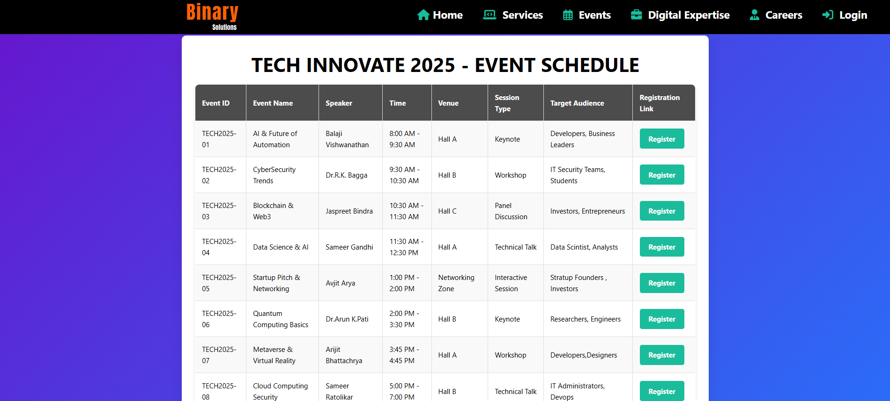

# Binary Solutions – Enterprise Software Portal

An interactive single-page experience for Binary Solutions that brings together marketing content, event programming, client services, and a lightweight quiz—all built with vanilla web technologies for easy hosting on any static site platform.

## Table of Contents
- [Overview](#overview)
- [Screenshots](#screenshots)
- [Features](#features)
- [Project Structure](#project-structure)
- [Getting Started](#getting-started)
- [Usage Tips](#usage-tips)
- [Customization](#customization)
- [Tech Stack](#tech-stack)
- [Roadmap](#roadmap)
- [Contributing](#contributing)
- [License](#license)

## Overview
The portal highlights Binary Solutions' services, digital expertise, locations, and employee benefits while promoting the **Tech Innovate 2025** conference. It also includes a client access form, embedded partner content, and a short quiz to keep visitors engaged. Everything is bundled into a single HTML entry point (`Software_Company_Website/integrated.html`) that references local styles, scripts, and media assets.

## Screenshots
| Landing Page | Tech Conference Schedule | Client Access Portal |
| --- | --- | --- |
|  |  |  |
| _Hero section with company overview and navigation_ | _Interactive event schedule with registration links_ | _Client access form with validation ready inputs_ |

## Features
- **Brand-forward hero section** with marquee hiring notice and company overview.
- **Service catalog** outlining core offerings and tech expertise with iconography from Font Awesome.
- **Conference schedule** rendered as a rich table with external registration links.
- **Digital expertise carousel-style layout** highlighting capability pillars.
- **Client access portal** with validation-ready form inputs and gender selection.
- **Embedded partner iframe** for cross-promotions.
- **Emerging technologies quiz** (`Quiz.html`) with clear instructions.
- **Modal login & signup dialog** scaffolding for future authentication logic.

## Project Structure
```
enterprise-software-portal/
├── assets/
│   ├── screenshots/          ← project screenshots
│   ├── Organization_icon.png
│   ├── Organization_img.jpg
│   └── Organization_logo.png
├── css/
│   └── integrated.css        ← main stylesheet
├── js/  
│   └── integrated.js         ← interactive functionality
├── integrated.html           ← primary landing page
├── Quiz.html                 ← standalone quiz experience
├── LICENSE                   ← MIT license
└── README.md        
```
## Usage Tips
- Use the navigation bar links to jump to on-page sections (`#services`, `#conference`, `#expertise`, etc.).
- Click **Careers** to open the external Typeform job application.
- The **Login** button triggers a modal. Validation helpers can be hooked up in `integrated.js`.
- Explore the **Quiz** via the call-to-action button at the end of the page.

## Customization
- Replace images in `assets/` with brand-specific media (keep the same filenames or update the HTML references).
- Update conference data directly within the `<table>` in `integrated.html`.
- Adjust colors, typography, or layout in `css/integrated.css`.
- Enhance interactivity—form validation, quiz scoring, or API integrations—via `js/integrated.js`.

## Tech Stack
- **HTML5** for semantic structure.
- **CSS3** (Flexbox, responsive layout, marquee accents).
- **Vanilla JavaScript** hooks prepared for future dynamic behaviour.
- **Font Awesome 6** CDN for icons.

## Roadmap

- [x] **Login/Signup Modal System** - Complete authentication UI with gradient design
- [x] **User Profile Management** - Circular avatar with dropdown profile card
- [x] **Local Storage Integration** - Persistent user sessions and data
- [x] **Form Validation** - Real-time validation with success/error states
- [x] **Responsive Profile UI** - Mobile-friendly profile placement and interactions
- [x] **Mobile Optimization** - Full viewport hero section on mobile devices
- [x] **Department Dropdown Styling** - Custom select styling with gradients
- [x] **Toast Notifications** - User feedback system for auth actions
- [ ] **Password Strength Indicator** - Real-time password security feedback
- [ ] **Remember Me Functionality** - Extended session persistence
- [ ] **Email Verification** - Mock email verification workflow

## Contributing
1. Fork the repository and clone your fork.
2. Create a feature branch:
   ```bash
   git checkout -b feature/amazing-improvement
   ```
3. Commit changes following conventional commits if possible.
4. Open a pull request explaining the motivation and screenshots for UI updates.

## License
This project is released under the [MIT License](LICENSE). Feel free to adapt it for your organization while retaining attribution.